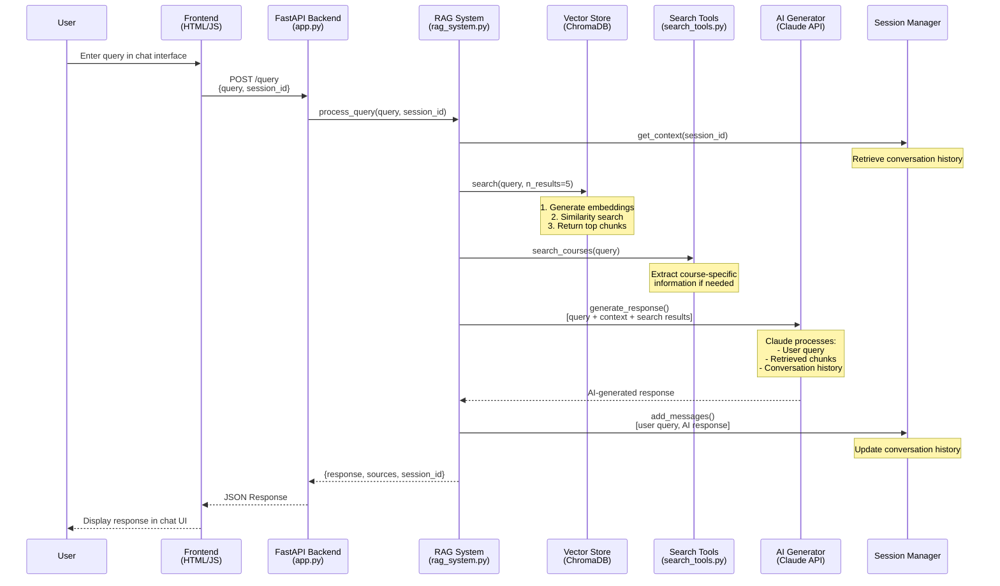
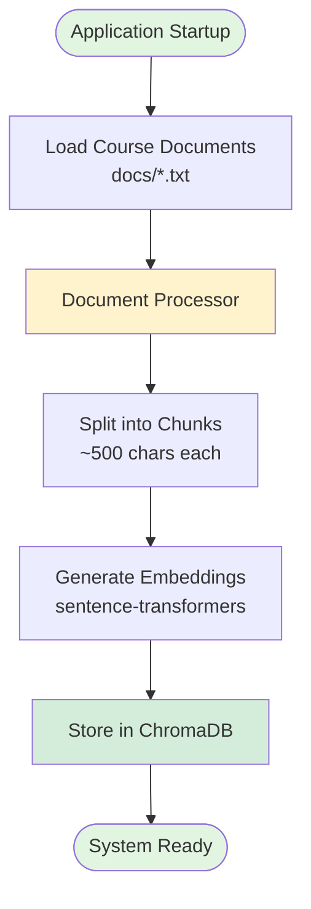
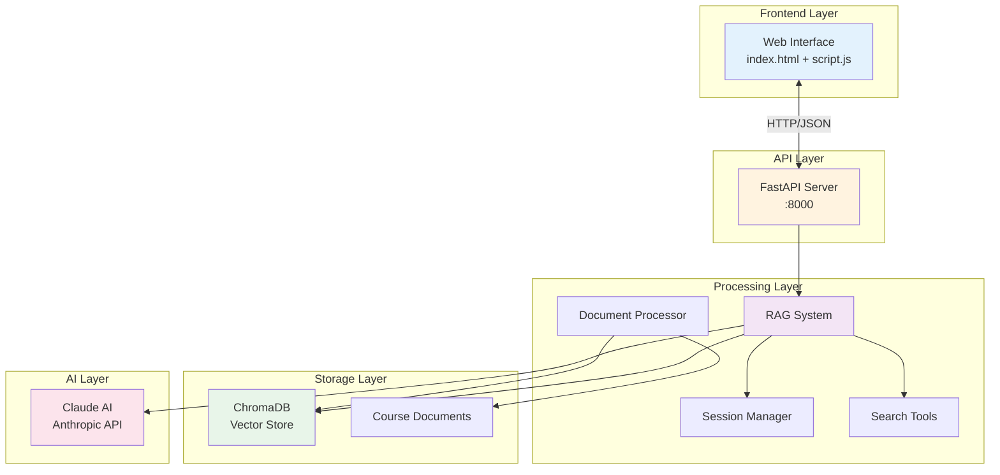

# RAG System Information Flow Diagram

## Request/Response Flow



## Data Processing Pipeline (Startup)



## Component Interaction Overview



## Key Data Structures

```
Request Flow:
├── User Query (string)
├── Session ID (string)
└── Processing:
    ├── Embeddings Generation
    ├── Vector Search (top 5 chunks)
    ├── Context Building:
    │   ├── Retrieved chunks
    │   ├── Conversation history  
    │   └── Search tool results
    └── AI Response Generation

Response Flow:
├── AI Response (string)
├── Sources (list of chunks)
├── Session ID (string)
└── Metadata (timestamps, course info)
```